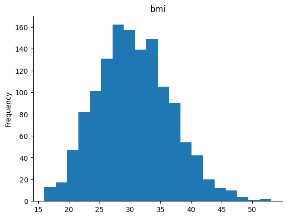

# Health-Cost-Predictor
 - [Code](Health_cost_predictor.ipynb)
 - [Overview](#overview)
 - [Dataset](#dataset)
 - [Model](#model)
  -[Conclussions](#conclussions)
## Overview
All the code is provided in the [`Health_cost_predictor.ipynb`](Health_cost_predictor.ipynb) notebook in the repo.

In this project I learned to create models that are able to predict data, learning from historical datasets. These types of models are most commonly used in insurance, and finance to predict future values. I tried 4 different algorithm and compared their performance:
- [Linear Regression](#linear-regression)
- [SVM](#support-vector-machine-svm)
- [Random Forest](#random-forest)
- [Gradient Boosting](#gradient-boosting)

The model "learns" from a training set, what are the expected medical expenses according to a limited set of parameters (age, bmi, smoker, sex, ...). And is later able to predict expenses for any given input of parameters - it will accurately predict the expenses of a person that may not even exist. 

On more technical terms, the models are initialized with a random set of weights and biases, and we can use different modelling techniques to changes those vales. The model will then estimate the weights and biases that adjust with less error to the output desired from our training set. Often, we there is no correlation between performance in the training and testing sets, as the model could be overfit to the training set. 

The results were surprising, with models being able to predict actual expenses with less than a 20% error rate. This of course could be substantially improved with a larger dataset, but the exact same modelling techniques. 

## Dataset
We are only considering a total 1338 cases, which is relatively small, but serves as it is easy and fast to manipulate these models. We use `Numpy` and `Pandas` to model and manipulate our data. 

The first step is to quantize our data, converting it into numerical values that our model can interpret. This is done with a direct mapping of words to numbers. 

After we have a fully numerical dataset, it is helpful to view the data we are analysing: 

The BMI behaves like a normal distribution, as expected from a Random Process:

And we can also see the demographics of our group: 

A key step is to separate our data into a training and testing set. I decided to take the arbitraty proportion of `80-20`, which is generally good enough for these small models. We also need to isolate the parameter we are calculating into a separate dataset.  

## Models
We can then train our models with the training data, and have them make predictions with the testing data. We then compare those predictions to the actual results, and select the best model.

This is a table with some of the calculated values, versus the actual ones:

| Actual | Lr          | svm         | rf         | gr         |
|--------|-------------|-------------|------------|------------|
| 764    | 9095.07     | 8931.642854 | 9548.273266| 10041.8873 |
| 887    | 5272.18     | 7108.658375 | 9492.505366| 5264.4983  |
| 890    | 29330.98    | 36911.245886| 9648.766753| 28298.9801 |
| 1293   | 9301.89     | 9492.186731 | 9555.013641| 10678.6877 |
| 259    | 33750.29    | 27005.514588| 9420.413342| 34443.8294 |

And we can plot some an arbitrary set of points for better visualization: 

And calculate the Mean Squared Error gives:

| Lr          | Svm         | Rf         | Gr         |
|-------------|-------------|------------|------------|
| 4186.9      | 8592.42     | 2529.84    | 2504.85    |

Where `Gradient Boosting` amd `Random Forest` are clearly the winners.

Here is a brief description of the models: 

### Linear Regression
Linear Regression is a statistical method that models the relationship between a dependent variable and one or more independent variables by fitting a linear equation to observed data. It's best used for predicting outcomes where the relationship between the variables is linear. In this case, it gives an adecuate prediction .

### Support Vector Machine (SVM)
Support Vector Machine (SVM) is a powerful classification technique that works by finding the hyperplane that best separates different classes in the feature space. SVM can also be used for regression tasks (SVR) and is effective in high-dimensional spaces. 

In this case, it gives a very poor prediction as the values values are not aligned on a planar space and have a high variance

### Random Forest
Random Forest is an ensemble learning method that operates by constructing a multitude of decision trees at training time and outputting the class that is the mode of the classes (classification) or mean prediction (regression) of the individual trees. Random forests correct for decision trees' habit of overfitting to their training set.

### Gradient Boosting
Gradient Boosting is an ensemble technique that builds models in a stage-wise fashion. It constructs new models that predict the residuals or errors of prior models and then combines these models through a weighted sum to make the final prediction. This method is highly flexible and can optimize on different loss functions and provides several hyperparameter tuning options that make the function fit very flexible.

## Conclussions

Gradient Boosting and Random Forest are particularly effective for the health cost calculator example due to their ability to handle complex, non-linear relationships between features. Health cost prediction involves various factors (age, BMI, smoking status, etc.) that interact in complex ways. 

- **Random Forest** works well because it can capture the variance in the data by building multiple decision trees and aggregating their predictions, reducing the risk of overfitting and improving prediction accuracy on unseen data.

- **Gradient Boosting**  focuses on correcting the mistakes of previous models in a sequential manner, allowing it to adaptively improve predictions in areas where the model is weak. This method is particularly useful in scenarios like health cost prediction, where the relationship between input variables and costs can be highly non-linear and influenced by outlier values.

Both models are capable of capturing the intricate patterns in the data, making them suitable for predicting healthcare costs, which are influenced by a combination of multiple factors and their interactions.

If we take the average mean error of (`2504.85`) and divide it by the average value of the expenses (``13270.42``) we get a percentage error of `18.8%`, very surprising for such a small model.  